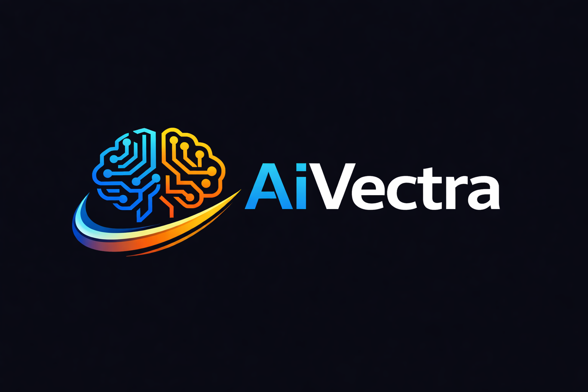

# AiVectra

AiVectra is the vector-based user interface system for AiLang.

It provides deterministic, resolution-independent rendering across platforms while preserving AiLang’s semantic authority.

AiVectra does not define language behavior.
It renders it.

---

## Purpose

AiVectra enables portable GUI applications for:

- macOS
- Linux
- iOS
- Android
- Web
- Embedded targets (future)

All UI is defined using vector primitives and layout constructs governed by AiLang.

---

## Core Principles

### 1. Vector First

All UI elements are defined as scalable vector primitives.

No raster-first assumptions.
No fixed-resolution layouts.

Rendering must be resolution-independent.

---

### 2. Deterministic Layout

Layout behavior must be:

- Predictable
- Canonical
- Spec-governed
- Testable via golden outputs

If layout behavior changes:
1. Update spec
2. Update golden tests
3. Then update implementation

Never the reverse.

---

### 3. Semantic Authority Lives in AiLang

AiVectra does not:

- Define UI behavior
- Interpret application logic
- Introduce host-specific semantics

UI structure, state transitions, and rendering rules are defined in AiLang.

AiVectra executes rendering instructions.

---

### 4. Host Is Mechanical

Platform renderers:

- Translate vector instructions to native surfaces
- Provide input events
- Provide surface lifecycle management

They must not introduce behavior not described in spec.

The host is replaceable.

---

## Architecture Overview

AiLang Application
        ↓
AiLang Evaluator
        ↓
Vector Scene Graph (AiVectra)
        ↓
Platform Renderer (mechanical)
        ↓
Native Surface

AiVectra operates as a deterministic vector scene system.

---

## Rendering Model

AiVectra is designed as:

- Retained-mode scene graph
- Deterministic layout pass
- Deterministic paint pass
- Canonical ordering rules

No implicit z-index behavior.
No platform-dependent layout differences.
No hidden measurement passes.

All rendering must be reproducible.

---

## Scope (Current)

- Vector primitives (path, rect, circle, text)
- Deterministic layout model
- Scene graph structure
- Platform abstraction layer

Not in scope:

- Animation systems (initially)
- GPU optimization passes
- Styling engines beyond spec definition
- Platform-specific visual effects

Stability over feature velocity.

---

## Relationship to AiLang

AiLang defines:

- UI structure
- Component composition
- State transitions
- Layout rules
- Rendering instructions

AiVectra renders those instructions.

The runtime is an implementation detail.
The spec is authoritative.

---

## Status

Early architecture phase.

Current focus:

- Scene graph design
- Layout determinism
- Platform abstraction boundary
- Golden test strategy

---

## Project Layout

This repository is initialized as an **AiLang workspace** with two projects:

- `src/AiVectra/project.aiproj` - AiVectra library manifest
- `src/AiVectra/src/lib.aos` - library exports (`library`, `version`, `rect`, `circle`, `text`, `label`, `window`, `helloWindow`, `helloWindowScene`)
- `examples/aivectra-example/project.aiproj` - example app manifest (includes AiVectra metadata)
- `examples/aivectra-example/src/app.aos` - runnable app importing the library module

---

## Local Run

Use `airun` from your normal toolchain (`PATH`).  
If you have a temporary local binary in this repo, replace `airun` with `./.tools/airun`.

Run the example app from repo root:

`airun run ./examples/aivectra-example/src/app.aos`

Run the library project directly (sanity check):

`airun run ./src/AiVectra/src/lib.aos`

Windowed hello world baseline:

- `helloWindowScene` exports a canonical window scene string with a title and `Label("Hello, World!")` body.
- `helloWindow()` returns that same scene through the function API shape.
- `window(specAndContent)` gives a low-level constructor for custom window strings.

---

## Philosophy

Resolution-independent.
Deterministic.
Spec-governed.
Replaceable host.
No semantic leakage.

---

AiVectra — deterministic vector UI for AiLang.
