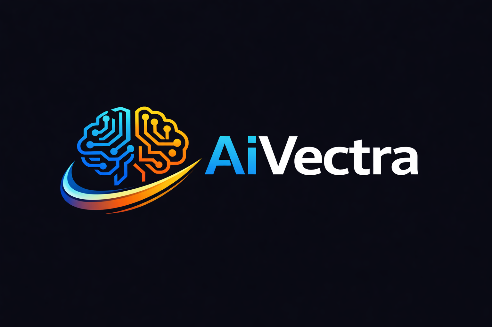

# AiVectra

AiVectra is the vector-based user interface system for AiLang.

It provides deterministic, resolution-independent rendering across platforms while preserving AiLang’s semantic authority.

AiVectra does not define language behavior.
It renders it.

---

## Purpose

AiVectra enables portable GUI applications for:

- macOS
- Linux
- iOS
- Android
- Web
- Embedded targets (future)

All UI is defined using vector primitives and layout constructs governed by AiLang.

---

## Core Principles

### 1. Vector First

All UI elements are defined as scalable vector primitives.

No raster-first assumptions.
No fixed-resolution layouts.

Rendering must be resolution-independent.

---

### 2. Deterministic Layout

Layout behavior must be:

- Predictable
- Canonical
- Spec-governed
- Testable via golden outputs

If layout behavior changes:
1. Update spec
2. Update golden tests
3. Then update implementation

Never the reverse.

---

### 3. Semantic Authority Lives in AiLang

AiVectra does not:

- Define UI behavior
- Interpret application logic
- Introduce host-specific semantics

UI structure, state transitions, and rendering rules are defined in AiLang.

AiVectra executes rendering instructions.

---

### 4. Host Is Mechanical

Platform renderers:

- Translate vector instructions to native surfaces
- Provide input events
- Provide surface lifecycle management

They must not introduce behavior not described in spec.

The host is replaceable.

---

## Architecture Overview

AiLang Application
        ↓
AiLang Evaluator
        ↓
Vector Scene Graph (AiVectra)
        ↓
Platform Renderer (mechanical)
        ↓
Native Surface

AiVectra operates as a deterministic vector scene system.

---

## Rendering Model

AiVectra is designed as:

- Retained-mode scene graph
- Deterministic layout pass
- Deterministic paint pass
- Canonical ordering rules

No implicit z-index behavior.
No platform-dependent layout differences.
No hidden measurement passes.

All rendering must be reproducible.

---

## Scope (Current)

- Vector primitives (path, rect, circle, text)
- Deterministic layout model
- Scene graph structure
- Platform abstraction layer

Not in scope:

- Animation systems (initially)
- GPU optimization passes
- Styling engines beyond spec definition
- Platform-specific visual effects

Stability over feature velocity.

---

## Relationship to AiLang

AiLang defines:

- UI structure
- Component composition
- State transitions
- Layout rules
- Rendering instructions

AiVectra renders those instructions.

The runtime is an implementation detail.
The spec is authoritative.

---

## Style Guides

AiLang and AiVectra are AI-first tools.

Authoring style must optimize for:

- determinism
- explicit structure
- stable naming
- safe AI-driven modification

See:

- `SPEC/STYLE_AILANG.md`
- `SPEC/STYLE_AIVECTRA.md`

---

## Status

Early architecture phase.

Current focus:

- Scene graph design
- Layout determinism
- Platform abstraction boundary
- Golden test strategy

---

## Project Layout

This repository is an **AiLang workspace** with:

- `src/AiVectra/project.aiproj` - AiVectra library
- `src/AiVectra.Cli/project.aiproj` - AiVectra CLI
- `samples/HelloWorld/project.aiproj` - hello-world sample
- `samples/HelloName/project.aiproj` - hello-name sample
- `samples/InteractiveSvgMvp/project.aiproj` - interactive SVG sample
- `samples/WeatherApp/project.aiproj` - weather sample (in progress)

Canonical AiVectra app structure:

- `project.aiproj`
- `AGENTS.md` (required)
- `Src/app.aos`
- `Assets/icons/app.svg` (single canonical icon source)
- `Assets/images/` (optional)
- `Assets/fonts/` (optional)
- `Assets/styles/` (future)
- `Assets/locale/en.toml` (optional)
- See `SPEC/APP_STRUCTURE.md` for the normative layout.
- `Targets/macos/*` (optional platform overrides)
- `Targets/windows/*` (optional platform overrides)
- `Targets/linux/*` (optional platform overrides)
- `.toolchain/` (generated by AI agents, gitignored)

---

## Local Run

Use `airun` from your normal toolchain (`PATH`).  
If you have a temporary local binary in this repo, replace `airun` with `./.tools/airun`.

Run the sample app from repo root:

`airun run ./samples/HelloWorld/`

Run the named greeting example:

`airun run ./samples/HelloName/`

`HelloName` uses GUI text entry from key events and a clickable `Submit` button to switch to the greeting view.

Wrapper/CLI:

- `./scripts/aivectra` is a thin wrapper over `airun` (no project-specific default).
- Override runtime location with env or flag:
  - `AIRUN_BIN=/path/to/airun ./scripts/aivectra`
  - `./scripts/aivectra --airun /path/to/airun`
- Example:
  - `./scripts/aivectra doctor`
  - `./scripts/aivectra test`
  - `./scripts/aivectra init MyApp`
  - `./scripts/aivectra run ./samples/HelloWorld/`
  - `./scripts/aivectra run ./samples/InteractiveSvgMvp/`
  - `./scripts/aivectra icon ./samples/HelloWorld/`
  - `./scripts/aivectra input --window "AiVectra Weather" --events "clickr:56,110;text:10001;key:enter"`
- Tool-side input injection (no sample/app instrumentation required):
  - `./scripts/aivectra input --window "<title-substring>" --events "<tokens>"`
  - tokens are semicolon-delimited:
    - `text:<value>`
    - `key:<name>` (`enter`, `backspace`, `left`, `right`, `cmd+w`, etc.)
    - `click:x,y` absolute screen coordinates
    - `clickr:x,y` relative to matched window origin
    - `touch:x,y` / `touchr:x,y` aliases to click
    - `wait:ms`
    - `close` (sends `cmd+w`)
  - optional flags:
    - `--delay-ms N` (default 35)
    - `--dry-run`
- Debug tooling (TOML artifacts; no sample instrumentation):
  - `./scripts/bootstrap-golden-publish-fixtures.sh`
  - `./tools/airun debug run ./examples/debug/apps/debug_minimal.aos --out .artifacts/debug/hello-world`
  - `./tools/airun debug scenario ./examples/debug/scenarios/minimal.scenario.toml --name minimal`
  - `./scripts/test-debug-ci-parity.sh`
  - Debug APIs in the SDK/CLI are generic only; sample-specific debug formats must stay out of `src/AiVectra`.
- Golden checks:
  - `./scripts/test-golden-ui.sh`
  - `./scripts/test-interactive-svg-mvp.sh`
  - `./scripts/test-screenshot-debug-reality.sh` (requires macOS Screen Recording permission)
  - `./scripts/test-cli-contract.sh` (CLI parse/forwarding/cwd/exit conformance)
  - `./scripts/test-all.sh` (all gates; set `AIVECTRA_SCREENSHOT_TEST=1` to include screenshot reality)
- Artifact bundle files:
  - `config.toml`
  - `stdout.txt`
  - `vm_trace.toml`
  - `state_snapshots.toml`
  - `syscalls.toml`
  - `events.toml`
  - `diagnostics.toml`

Agent debug workflow:

- Bootstrap fixtures from clean checkout:
  - `./scripts/bootstrap-golden-publish-fixtures.sh`
- Run app with artifact capture:
  - `./tools/airun debug run ./examples/debug/apps/debug_minimal.aos --out .artifacts/debug/my-run`

CLI behavior contract:
- See `SPEC/CLI.md` for normative command grammar, forwarding, cwd inference, and exit semantics.
- Run deterministic replay from fixture (when provided by AiLang runtime):
  - `./tools/airun debug run ./examples/debug/apps/debug_minimal.aos --events ./examples/debug/events/minimal.events.toml --out .artifacts/debug/replay-run`
- Run named scenario fixture:
  - `./tools/airun debug scenario ./examples/debug/scenarios/minimal.scenario.toml --name minimal`
- CI parity check:
  - `./scripts/test-debug-ci-parity.sh`

App icon generation:

- Standard command: `./scripts/aivectra icon <project-path>`
- Default output style: AiLang logo mark (`style=ailang_logo`)
- Optional label override: `./scripts/aivectra icon <project-path> <label>` (`style=label_monogram`)
- Output:
  - `<project-path>/Assets/icons/app.svg`
  - `<project-path>/Assets/icons/manifest.txt`
- Default logo source asset in this repo:
  - `/Users/toddhenderson/RiderProjects/AiVectra/Assets/icons/ailang_default_appicon.svg`

Run the library project directly (sanity check):

`airun run ./src/AiVectra/src/lib.aos`

Native runtime note:
- `./scripts/aivectra` checks runtime capabilities from `airun --help`.
- When runtime requires prebuilt bytecode, wrapper emits:
  - `Err#err1(code=AIV001 ... )`
- When runtime supports source/project targets, wrapper runs `.aos`/project inputs directly.

Windowed hello world baseline:

- `samples/HelloWorld/src/app.aos` demonstrates direct syscall-backed rendering through AiVectra library primitives.

---

## Philosophy

Resolution-independent.
Deterministic.
Spec-governed.
Replaceable host.
No semantic leakage.

---

AiVectra — deterministic vector UI for AiLang.
